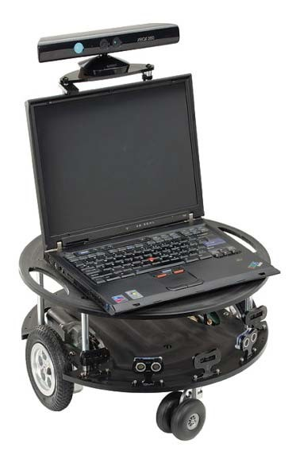
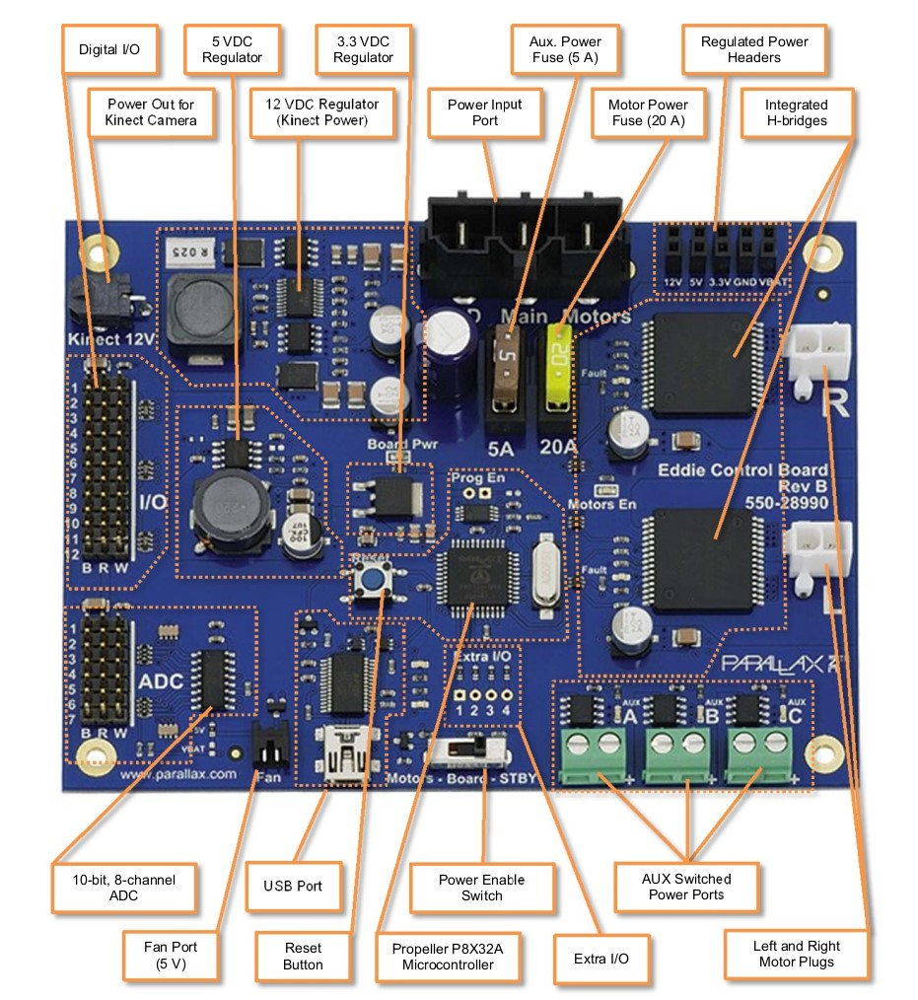
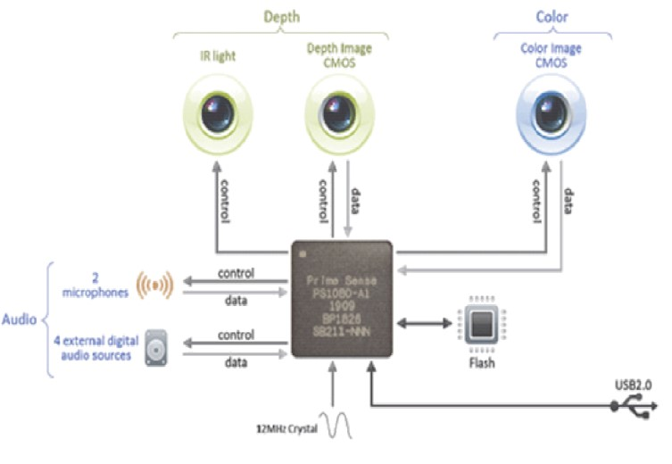

# Hardware Subsystems

Eddie is a versatile mobile robotics development platform. Eddie is equipped with 3D vision capabilities, utilizing the Microsoft Kinect, allowing it to perceive its surroundings in three dimensions.&#x20;

The platform is versatile, supporting applications like autonomous navigation, machine vision system development, tele-presence robots, personal assistant robots, security and surveillance robots, and crowd interaction and advertising.

## Eddie Platform

Eddie is a differential drive robot featuring a microcontroller with an integrated PID, two optical wheel encoders, two PWM driven motors, and two lead-acid batteries. The robot’s structure comprises a pair of top and bottom decks, along with an undercarriage designed to hold the batteries securely.

Eddie Platform

## **Range Sensors**

On its base, there are five distance sensors placed for collision avoidance. This sensor array comprises three infrared (IR) sensors and two ultrasonic sensors.

## **Wheel Encoders**

The 36-position Quadrature Encoders offer a reliable method to track the position and speed of each wheel continuously. When used with the included Encoder disks, each Encoder assembly provides a basic resolution of 36 positions per rotation. However, since there are two sensors in each assembly, the potential resolution increases to 144 positions per full tire rotation. This equates to a linear resolution of approximately 0.13 inches of travel per drive assembly when using the standard six-inch tires.&#x20;

It’s important to note that the actual resolution may be limited by the amount of backlash in the gear motor assemblies, which is approximately +/- 0.175 linear inches. The Position Controllers are compatible with any microcontroller via a single-wire half-duplex asynchronous serial communication (UART) bus.

## **Board**

The Eddie Control Board provides a complete single-board solution to control the Eddie Robot Platform. It utilizes the powerful Propeller P8X32A microcontroller, boasting eight 32-bit cores for impressive performance and versatility. The board incorporates high-current motor drivers, an eight-channel 10-bit ADC, and ample digital I/O options. It communicates via a USB mini-B connector, which enumerates as a serial COM port.

Board Overview

Most of the Propeller’s 32 general purpose I/O pins are used to interface with on-board peripherals, or connect to headers for sensor interfacing. The Digital I/O pins are brought out to twelve 3-pin headers near the edge of the board. The order of the pins from left to right is: Ground, 5V, Signal.

* The 1st and 2nd pins are connected to our two ultrasonic sensors.

For the analog to digital converter, the board is equipped with the Microchip MCP3008 which is an 8-channel, 10-bit ADC.

* The left-most IR Sensor cable is connected to “AD1”, the center IR sensor to “AD2”, and the right-most IR Sensor to “AD3”.

The three-pin cable from the right Position Controller is connected to Pin-set 11 in the “Encoders” section of the Control Board.

## Camera

The Kinect for Xbox 360 is a combination of software and hardware, featuring a range chipset technology by PrimeSense, which uses an infrared projector and camera to determine the location of nearby objects in 3D.

The Kinect sensor consists of an RGB camera, depth sensor, and microphone array, allowing for full-body 3D motion capture, facial recognition, and voice recognition capabilities.&#x20;

The depth sensor employs an infrared laser projector and monochrome CMOS sensor to capture 3D video data under any lighting conditions, with an adjustable sensing range and automatic calibration for different environments.

The software technology of Kinect enables advanced gesture recognition, facial recognition, and voice recognition, making it capable of simultaneously tracking up to six people.&#x20;

The Kinect’s various sensors output video at frame rates ranging from approximately 9 Hz to 30 Hz, with different resolutions and color formats. The sensor has a practical ranging limit of 1.2–3.5 meters and a field of view of 57° horizontally and 43° vertically, providing a high resolution of over 1.3 mm per pixel.&#x20;

To power the motorized tilt mechanism of the Kinect sensor, a proprietary connector combining USB communication and additional power is used, while older models require a special power supply cable that splits the connection into separate USB and power connections.

Kinect Components

