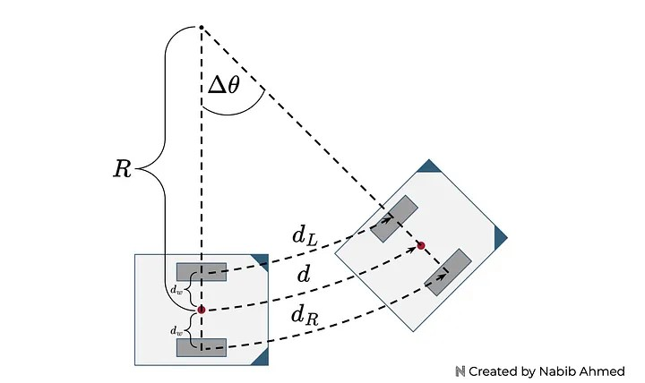
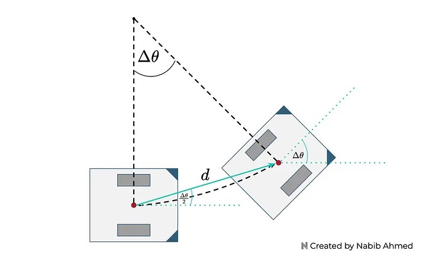
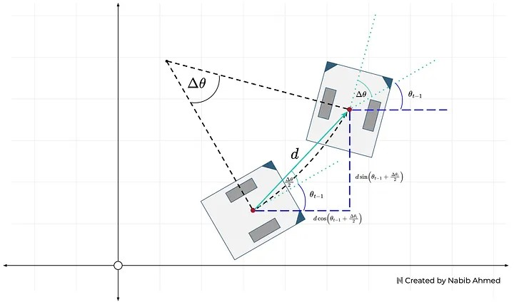

# Wheel Odometry Model

(Most of this are from [here](https://medium.com/@nahmed3536/wheel-odometry-model-for-differential-drive-robotics-91b85a012299).)

With the rotation data, alongside information on the encoder, such as the radius or circumference, we can estimate the distance traveled by the wheel.&#x20;

Since each slit represents some angle of rotation, knowing the number of slits passed informs us about the amount of rotation between time steps.&#x20;

For an optical encoder, where all the slits are equally spaced, we could get the total angle of rotation between time steps by multiplying the number of slits passed by the amount of rotation represented by a single slit.&#x20;

After we determine the angle of rotation, we can multiply it by the circumference of the encoder to get the distance traveled by the wheel.&#x20;

The goal of an odometry model is to estimate the position and orientation of the robot. To achieve this, we’ll leverage data from the rotary encoders, the dimensions of our robot, and geometry. The **encoder** will inform us of the **distance traveled by each wheel** at each time step.&#x20;

In terms of using the dimensions of our robot, the only dimension we need is the distance of the point from the left and right wheels. Since we defined our reference point to be located equidistant between the two wheels, we only need to keep track of one number.

Now let’s define some variables to keep track of these ideas:

<p align = "center">

</p>
<p align = "center">
Figure 4
</p>

* $d_L$= distance traveled by the left wheel.&#x20;
* $d_R$= distance traveled by the right wheel.
* $d_w$= distance between the reference point and the wheels.&#x20;
* $d$= distance traveled by the reference point.
* $\Delta \theta$= A change in the angle of rotation.
* $R$= radius of the curve containing the reference point.

$d_L$ and $d_R$ correspond to the **distance traveled by the wheel** at a certain time step. This information will come from our rotary encoder.

$d_w$ can be derived by measuring the **distance between the two wheels** and dividing it in half since the point is equidistant from the two wheels.&#x20;

The last three variables are not directly measurable — instead, we need to use geometry to relate these variables to the measurable quantities.

We can start by using the arc length formula. The path for the left wheel, right wheel, and reference points are arcs.&#x20;

They all share the **same angle** and the **radius** for each can be expressed in terms of the **radius of the curve containing the reference point** and the **distance between the reference point and the wheels**.

$$
d =  R\Delta \theta
$$

$$
d_L = (R-d_w)\Delta \theta
$$

$$
d_R = (R+d_w)\Delta \theta
$$

Now we solve for the **change in the angle of rotation** in terms of measurable quantities, getting the following relationship:

$$
\Delta \theta = \frac{d_R - d_L}{2d_w}
$$

Now we solve for the **radius of the curve containing the reference point** by rearranging equations and plugging in what we know.&#x20;

$$
R = d_L \frac{2d_w}{d_R - d_L}+d_w
$$

Then, we solve for the **distance traveled by the reference point**.

$$
d = \frac{d_R + d_L}{2}
$$


> **Note**\
> We solved for all variables in terms of measurable quantities. Since we’re interested in the robot’s position and orientation, the key variables of interest would be the _**distance traveled by the reference point**_ and the _**change in the angle of rotation**_.&#x20;

The **distance traveled by the reference point** informs us of the **position** and the **change in the angle of rotation** informs us of the **orientation**. The radius of the curve containing the reference point, while useful for derivation, is not really needed anymore.

* _Now, we know the distance traveled, but not the direction._&#x20;
* _We know how much the orientation angle changed, but not the new orientation angle._&#x20;

So we start modifying our odometry model.

To simplify our model, we will represent the **distance traveled by the reference point** as a _**line**_ instead of a _**curve**_. We can make this simplification because typically, in wheel odometry with encoders, the data sampling is very high.&#x20;

What this means is that our encoders are able to collect data very frequently so the time window between measurements is very small. Since the time window is very small, the amount of motion captured by each time step will also be small.

&#x20;For our model, that means the curvature of the arc will be very small and _resemble a straight line_. Thus, it’s a safe assumption and simplification to represent our distance now as a straight line.&#x20;

We then calculate the **angle of the distance** in terms of a previously solved variable, and the **new orientation** of the robot as shown in Figure 5:

<p align = "center">

</p>
<p align = "center">
Figure 5
</p>

In Figure 6, the odometry model at time $t$ will add the **absolute orientation angle** from the previous time step.&#x20;

<p align = "center">

</p>
<p align = "center">
Figure 6
</p>

> **Important**\
> Notice that adding the orientation from the previous time step won’t change the _distance traveled by the reference point_ or the _change in angle of rotation_ as the formulas we derived from earlier don’t rely on the orientation angle (only the **traveled wheel distances**).&#x20;

Instead what does change is the **orientation** of the robot, from being relative between time steps to now being **absolute** on the coordinate plane.&#x20;

Thus, the **absolute orientation angle** at any time step can be defined by:

$$
\theta_t = \theta_{t-1} + \Delta \theta_t
$$

Using the distance traveled by the reference point and the angle of orientation from the previous time step plus the angle that results from motion, the **amount of distance traveled along the x and y directions** can be calculated:

$$
x_t = x_{t-1} + d cos(\theta_{t-1} + \frac{\Delta \theta_t}{2})
$$

$$
y_t = y_{t-1} + d sin(\theta_{t-1} + \frac{\Delta \theta_t}{2})
$$

<p align = "center">

</p>
<p align = "center">
Figure 7
</p>

```cpp
EddieOdomPublisher::EddieOdomPublisher(std::shared_ptr<rclcpp::Node> node_handle) : nh_(node_handle)
{
    odom_pub_ = nh_->create_publisher<nav_msgs::msg::Odometry>("odom", 50);
    encoders_sub_ = nh_->create_subscription<eddiebot_msgs::msg::Encoders>("/eddie/encoders_data", 1,
      std::bind(&EddieOdomPublisher::encoder_cb_, this, std::placeholders::_1));

    x_ = y_ = th_ = 0.0;
    
    prev_left_encoder_cnt_ = prev_right_encoder_cnt_ = 0;

    odom_broadcaster_ = std::make_unique<tf2_ros::TransformBroadcaster>(nh_);

    current_time_ = last_time_ = nh_->get_clock()->now();
}

void EddieOdomPublisher::encoder_cb_(const eddiebot_msgs::msg::Encoders::ConstSharedPtr msg)
{
    current_time_ = nh_->get_clock()->now();
    double dt = (current_time_ - last_time_).seconds();

    // msg->left(right) is to the total tick of the left(right) encoder
    // delta_left_cnt represents the increment of the left encoder ticks
    int delta_left_cnt = msg->left - prev_left_encoder_cnt_;
    int delta_right_cnt = msg->right - prev_right_encoder_cnt_;

    double delta_th = 1.0 * (delta_right_cnt - delta_left_cnt) * DISTANCE_PER_COUNT / WHEEL_BASE;
    double delta_dist = 0.5 * (delta_right_cnt + delta_left_cnt) * DISTANCE_PER_COUNT;
    double delta_x = delta_dist * cos(th_);
    double delta_y = delta_dist * sin(th_);

    x_ += delta_x;
    y_ += delta_y;
    th_ += delta_th;

    if(th_ > TWOPI)
        th_ -= TWOPI;
    else if(th_ <= -TWOPI)
        th_ += TWOPI;

    // printf("x = %lf, y = %lf, th = %lf\n", x_, y_, th_);

    prev_left_encoder_cnt_ = msg->left;
    prev_right_encoder_cnt_ = msg->right;
    last_time_ = current_time_;
    RCLCPP_DEBUG(nh_->get_logger(),
                 "got x = %lf, y = %lf, th = %lf, dt = %lf\n", delta_x, delta_y, delta_th, dt);

    publish_odom_(delta_x, delta_y, delta_th, dt);
}

void EddieOdomPublisher::publish_odom_(double dx, double dy, double dth, double dt)
{
    //since all odometry is 6DOF we'll need a quaternion created from yaw
    geometry_msgs::msg::Quaternion odom_quat = createQuaternionMsgFromYaw(th_);
    //first, we'll publish the transform over tf
    geometry_msgs::msg::TransformStamped odom_trans;
    odom_trans.header.stamp = current_time_;
    odom_trans.header.frame_id = "odom";
    odom_trans.child_frame_id = "base_footprint";
    odom_trans.transform.translation.x = x_;
    odom_trans.transform.translation.y = y_;
    odom_trans.transform.translation.z = 0.0;
    odom_trans.transform.rotation = odom_quat;
    //send the transform
    odom_broadcaster_->sendTransform(odom_trans);

    //next, we'll publish the odometry message over ROS
    nav_msgs::msg::Odometry odom;
    odom.header.stamp = current_time_;
    odom.header.frame_id = "odom";
    //set the position
    odom.pose.pose.position.x = x_;
    odom.pose.pose.position.y = y_;
    odom.pose.pose.position.z = 0.0;
    odom.pose.pose.orientation = odom_quat;
    //set the velocity
    odom.child_frame_id = "base_footprint";
    odom.twist.twist.linear.x = dx / dt;
    odom.twist.twist.linear.y = dy / dt;
    odom.twist.twist.angular.z = dth / dt; 
    
    //publish the message
    odom_pub_->publish(odom);
}
```
