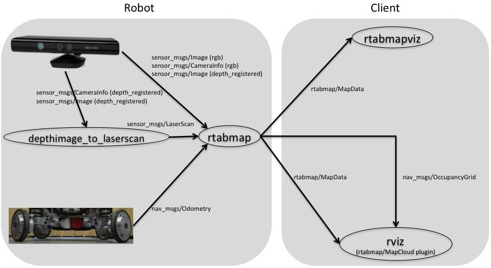

# vSLAM

The development of 2D laser scanners was a game-changer for robotics, but their high cost has become a bottleneck for widespread adoption.&#x20;

To enable the next wave of robot applications, more affordable RGB-D sensors and cameras are crucial, especially in challenging environments where 2D techniques are not suitable. These advancements will allow for broader robot deployment and address new problems in various industries.&#x20;

Some vSLAM approaches that we considered include:

#### ORB-SLAM3

ORB-SLAM3 is a versatile visual SLAM method designed to work with various sensors, including monocular, stereo, and RGB-D cameras. ORB-SLAM has often adapted to enhance odometry systems for service robots.&#x20;

The latest version, ORBSLAM3, introduces significant improvements, such as visual-inertial SLAM, allowing **sensor fusion** of _visual_ and _inertial_ sensors for more robust tracking in challenging environments with fewer point features. It also supports multi-map continuation and fish-eye camera compatibility, expanding its applicability to different camera types.

#### RTABMap

RTABMap is one of the oldest mixed-modality SLAM approaches. It stands out for its flexibility in accepting various input sensors, including stereo, RGB-D, fish-eye cameras, odometry, and 2D/3D lidar data.&#x20;

Unlike traditional feature-based SLAM methods, RTABMap creates dense 3D and 2D representations of the environment, making it unique and highly compatible as a semi-visual SLAM replacement. This characteristic allows for seamless integration into existing systems without additional post-processing, offering a compelling advantage.

#### OpenVSLAM

OpenVSLAM is a well-structured implementation of ORB feature-based Visual graph SLAM. It offers optimized feature extractors and stereo matchers, alongside a unique frame tracking module for fast and accurate localization, competing with state-of-the-art solutions. The versatility of OpenVSLAM allows it to work with various camera models, including equirectangular and fisheye, making it suitable for a wide range of applications.  


In the end, we opted for RTABMap for our ground robot experiments in a low-featured indoor facility equipped with an RGB-D camera.  
<br>
***
<br>

## RTABMap

RTAB-Map (Real-Time Appearance-Based Mapping) is a Graph SLAM approach that utilizes RGB-D data for real-time mapping. It employs a global Bayesian loop closure detector to efficiently detect and close loops in the mapping process.&#x20;

RTAB-Map can function independently with a handheld Kinect or stereo camera to perform 6DoF (degrees of freedom) RGB-D mapping. Alternatively, it can be used on a robot equipped with a laser rangefinder for 3DoF mapping with a 2D LiDAR or 6DoF mapping with a 3D LiDAR.

In the context of ROS, RTAB-Map is available as a package that serves as a wrapper for the RTAB-Map SLAM approach. This ROS package enables seamless integration and use of RTABMap with ROS-based systems. Various additional packages are available that can work in conjunction with RTAB-Map to generate 3D point clouds of the environment or create 2D occupancy grid maps, which are useful for navigation tasks.


In our specific case, where we have an **RGB-D camera**, **odometry** information from wheel encoders, and **fake laser scans** generated from depth images, we fine-tuned RTABMap’s parameters to achieve optimal performance and accuracy. Here’s how we adjusted the parameters:

<p align = "center">

</p>
<p align = "center">
<a href="http://wiki.ros.org/rtabmap_ros/Tutorials/SetupOnYourRobot">Kinect + Odometry + Fake 2D laser from Kinect</a>
</p>

#### For RTABMap’s ROS wrapper parameters:

```yaml
’subscribe_depth’: True 
```

_Subscribe to depth image_

```yaml
’subscribe_scan’: True
```

_Subscribe to laser scan_

```yaml
’subscribe_rgbd’: False
```

_Subsribe to `rgbd_image` topic._

```yaml
’qos_image’: LaunchConfiguration(’qos’)
```

```yaml
’qos_scan’: LaunchConfiguration(’qos’)
```

```yaml
’use_action_for_goal’: True
```

_Planning Use actionlib to send the metric goals to move\_base. The advantage over just connecting goal\_out to move\_base\_simple/goal is that rtabmap can have a feedback if the goal is reached or if move\_base has failed._

```yaml
’approx_sync’: True
```

_Use approximate time synchronization of input messages. If false, note that the odometry input must have also exactly the same timestamps than the input images._

```yaml
’tf_delay’: 4.0 
```

_Rate at which the TF from `/map` to `/odom` is published_


<br>

***

<br>


For most of UGV, the vehicle only runs on a flat ground, in this way, you can force the visual odometry to track the vehicle in only 3DOF (x,y,theta) and increase the robustness of the map.

For rtabmap, we can also constraint to 3 DoF loop closure detection and graph optimization.

For RTABMap’s parameters:

```yaml
’Optimizer/Strategy’: ’1’
```

_Graph optimization strategy: 0=TORO, 1=g2o, 2=GTSAM and 3=Ceres._

```yaml
’RGBD/ProximityBySpace’: ’false’
```

_Detection over locations (in Working Memory) near in space._

```yaml
’Reg/Force3DoF’: ’true’
```

```yaml
’Vis/MinInliers’: ’12’
```

_Minimum feature correspondences to compute/accept the transformation._

```yaml
’RGBD/AngularUpdate’: ’0.01’
```

_Minimum angular displacement (rad) to update the map. Rehearsal is done prior to this, so weights are still updated._

```yaml
’RGBD/LinearUpdate’: ’0.01’
```

_Minimum linear displacement (m) to update the map. Rehearsal is done prior to this, so weights are still updated._

```yaml
’RGBD/OptimizeFromGraphEnd’: ’false’
```

_Optimize graph from the newest node. If false, the graph is optimized from the oldest node of the current graph (this adds an overhead computation to detect to oldest node of the current graph, but it can be useful to preserve the map referential from the oldest node). Warning when set to false: when some nodes are transferred, the first referential of the local map may change, resulting in momentary changes in robot/map position (which are annoying in teleoperation)._  

<br>

***

<br>
By fine-tuning these parameters, we were able to tailor RTABMap to our specific setup. This process allowed us to achieve reliable and accurate SLAM results in our low-featured indoor facility.

